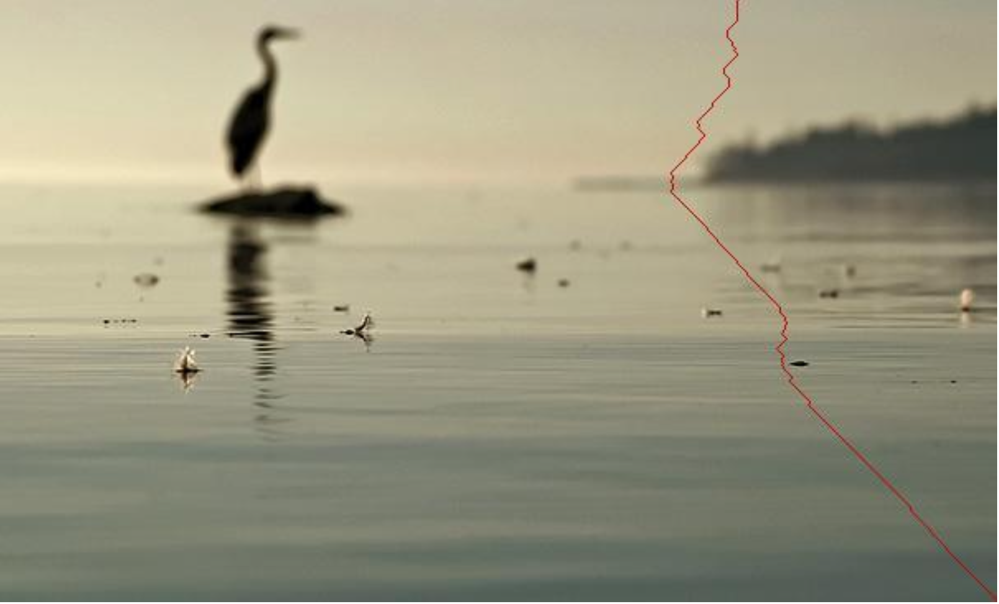

# Seam Carving for Content-Aware Image Resizing

This project implements the Seam Carving algorithm, a content-aware image resizing technique that intelligently resizes images while preserving important visual content. Users can specify the desired output dimensions, and the algorithm resizes the image by removing or adding seams of pixels with the least energy.

## Features
- **Seam Identification**: Identifies and removes vertical or horizontal seams with the lowest energy.
- **Energy Calculation**: Uses a gradient-based energy function to compute the importance of each pixel.
- **Content-Aware Resizing**: Dynamically resizes images without distorting key features.

## Steps Involved
1. **Energy Calculation**: Computes energy for each pixel using gradient-based techniques (e.g., dual-gradient energy function).
2. **Seam Identification**: Finds the vertical or horizontal seam with the lowest total energy.
3. **Seam Removal**: Removes the identified seam to reduce the image dimensions.

# Seam Carving for Content-Aware Image Resizing

## Example
| Input Image | Lowest Energy Seam Image | Resized Image |
| ----------- | ------------------------ | ------------- |
|  |   | 
